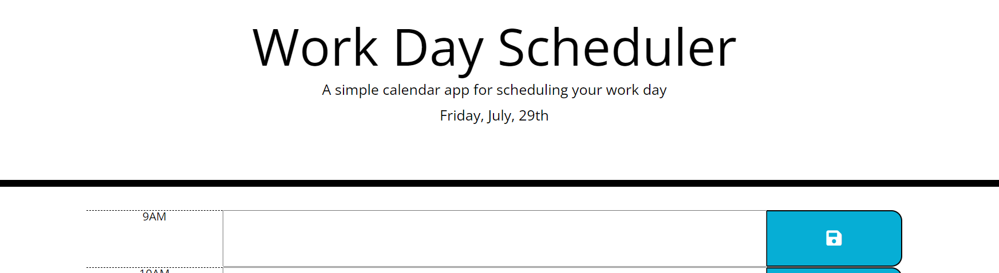

# Third Party API

## Description

The purpose of this project was to use third party APIs like jQuery, bootstrap, and moment.js to create a workday scheduler that tracks the current day and current hour and saves user input text notes in each hour block to local storage such that the user can use it to plan their day. This project helped me become more comfortable using third party APIs

## Shout out 

Credit is due to Joshua Rae, Freddy Kwak, and Juliana Lamond as they are all part of my study group. 

## Link

See page at: https://tabithaly.github.io/third-party-api/